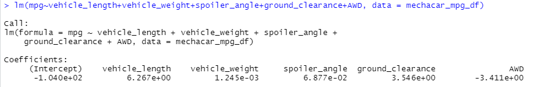
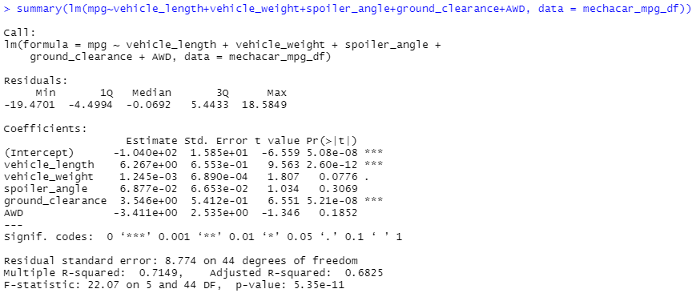
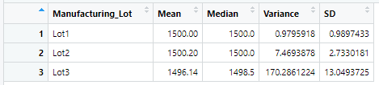
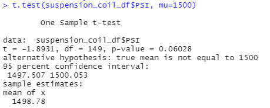
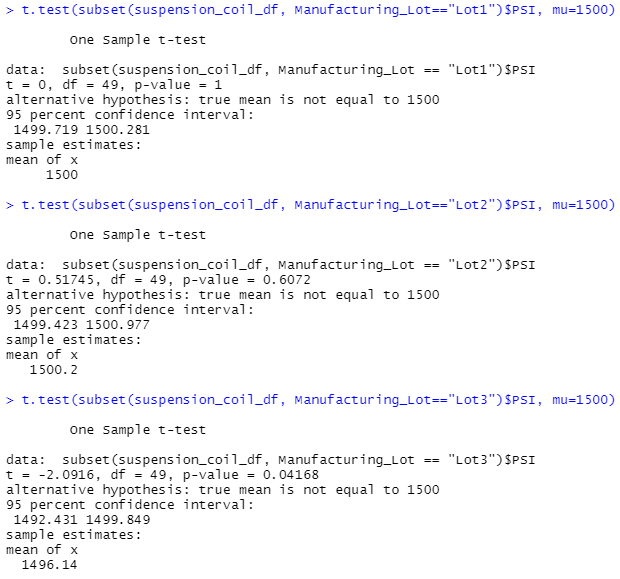

# MechaCar Statistical Analysis

## Overview
AutosRUs is requiring the analytics team to review the production data for insights that may help the manufacturing team. 

The following are the tasks requested of the analytics team:
1. Perform multiple linear regression analysis to identify which variables in the dataset predict the mpg of MechaCar prototypes.
2. Collect summary statistics on the pounds per square inch (PSI) of the suspension coils from the manufacturing lots.
3. Run t-tests to determine if the manufacturing lots are statistically different from the mean population.
4. Design a statistical study to compare vehicle performance of the MechaCar vehicles against vehicles from other manufacturers. For each statistical analysis, you’ll write a summary interpretation of the findings.

## Results
### Linear Regression to Predict MPG

Linear Regession on the `MechaCar_mpg.csv` data set.

Summary Function used to obtain the p-value and r-squared value for the Linear Regression model.

#### Conclusions
1. The most significant variables in the dataset that show a non-random effect on the MPG of the MecaCar are the **Vehicle Length** amd the **Ground Clearance**. The Vehicle Length's p-value is 2.60x10-12 and the Ground Clearance's p-value is 5.21x10-8. The Intercept is also statistically significant. 

2. The slope of the linear model is not considered to be zero. The p-value of the linear model was much smaller than the significannt level which provides enough statistical evidence that the null hypothesis is **not** true.

3. The R-squared value is 0.715, which is **71.5%**, this shows that there is a 71.5% chance future data will fit these data points and therefore, this prediction is effective.

### Summary Statistics on Suspension Coils

Total Summary Statistics of the `Suspension_Coil.csv` data set.

Summary Statistics of the `Suspension_Coil.csv` data set by Lot Number.

The total summary statistics model shows the variance to be 62.30 PSI, this is below the 100 PSI threshold, however when the statistics are pulled by lot, Lot 3's variance is 170.29 PSI which is over the 100 PSI limit.

### T-Tests on Suspension Coils

T-Test performed on all Manufacturing Lots.

The p-value in the T-Test performed on all the lots together is 0.060 which is higher than the 0.05 common significance level, therefore we **cannot** reject the null hypothesis.

T-Test performed for Lot 1, Lot 2, and Lot 3.

The p-value of Lot 1 (p = 1) and Lot 2 (p = 0.607) proves there is not enough evidence to reject the null hypothesis because the sample mean and the population mean are not statistically different. However, in Lot 3 the P-value is 0.042 which is below the 0.05 common significance level, therefore we **can** reject the null hypothesis.

### Study Design: MechaCar vs Competition
What metric or metrics are you going to test?

What is the null hypothesis or alternative hypothesis?

What statistical test would you use to test the hypothesis? And why?

What data is needed to run the statistical test?
